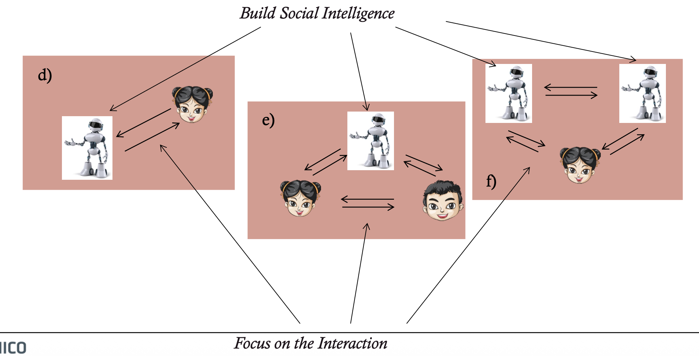
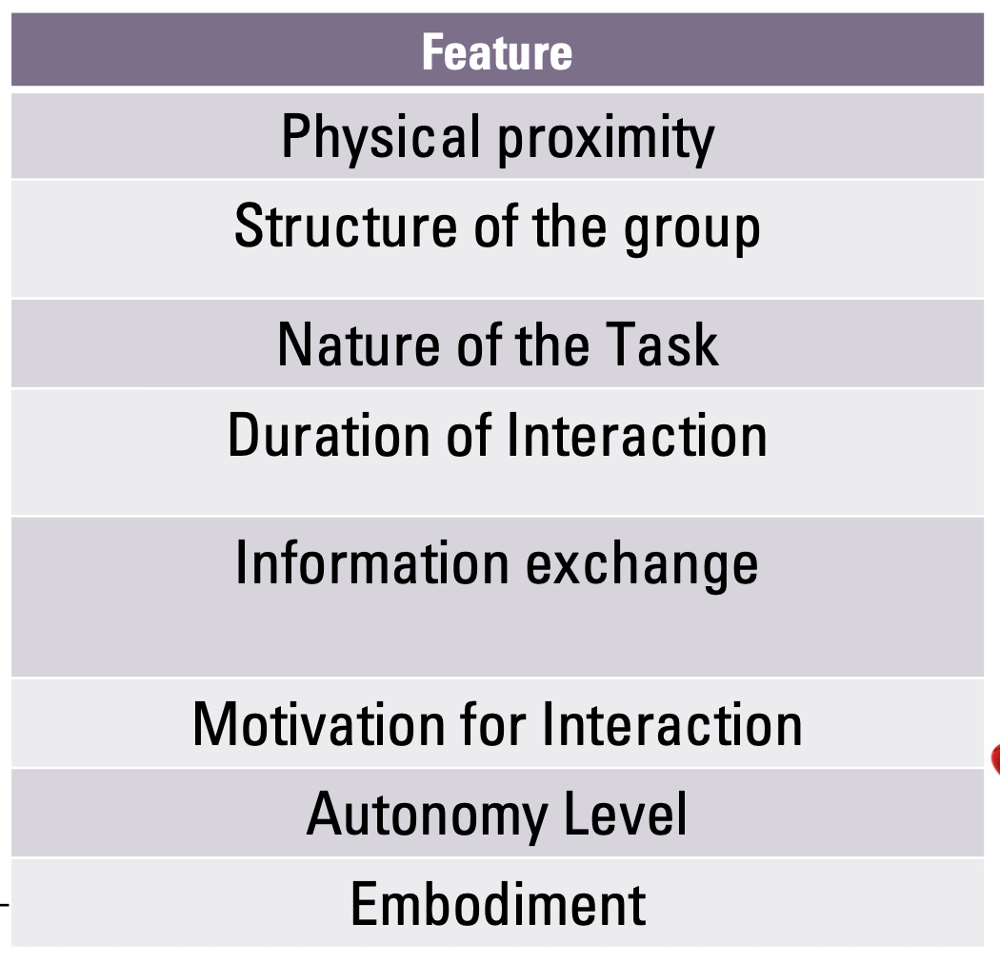
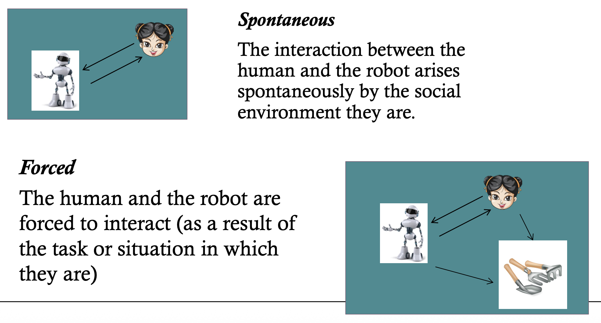
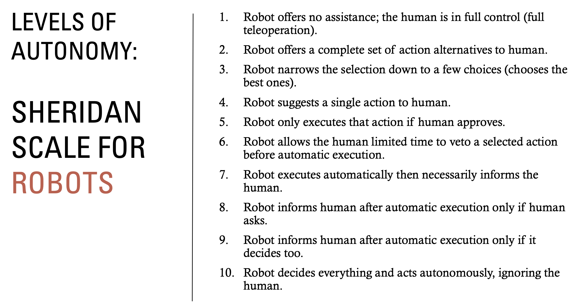
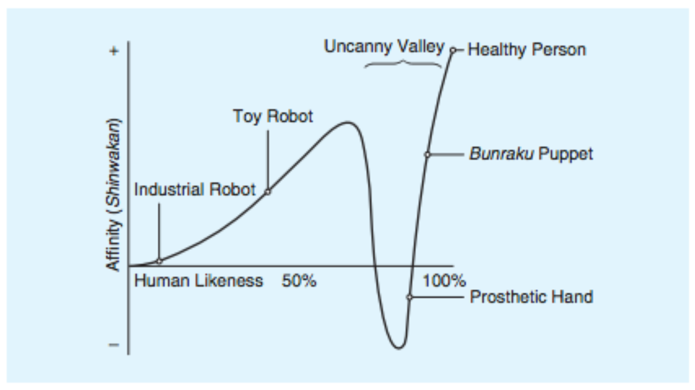
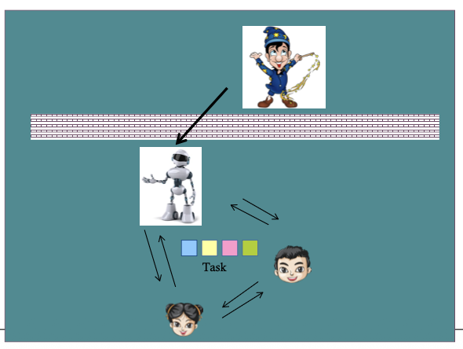

# Week 1

## 1.1. Features of Interaction

**"Social" Robot:** is a **physical entity embodied in a complex, dynamic, and social environment[1]**, sufficiently **empowered to behave in a manner conducive to its own goals and those of its community[2]**, being **capable to recognize others and engage in social interactions with them.[3]**

We will explore the following scenarios:

### Interaction:

- Historically, computing power was expensive → robots optimized for tasks.
- Now, computing is abundant → interaction design should optimize human time and enhance cooperation.

**Interaction = process of working together to accomplish a goal.**

Emerges from a combination of factors such as:
1. Robot embodiment
2. Proximity
3. Task
4. Autonomy
5. Group structure

All of these *condition* the type and quality of interaction.

>Examples of Interaction Scenarios:
>
>**Case 1: Museum Tour Guide Robot**
>- Spontaneous
>- Task-oriented
>- Social
>- Short-term (one-time)
>- Non-individualised
>
>**Case 2: Tomato-Harvesting Robots**
>- Spontaneous
>- Task-oriented
>- Social
>- Short-term
>- Non-individualised
>
>**Case 3: Autism Therapy Robot**
>- Controlled
>- Both social + task-oriented
>- Long-term
>- Personalised

### Features of Human-Robot Interaction (HRI)

### Feature 1: Physical Proximity

**Remote Interaction**
- Human and robot not co-located (e.g., Mars Rovers).
- Can also be separated temporally.

**Proximate Interaction**
- Human and robot physically near each other (e.g., service robot in a room).

**“Deep” Interaction**
- **Human + robot** become a unified entity (e.g., exoskeletons).
- Robot extends human physical/cognitive capabilities.

### Feature 2: Group Structure

>A group exists when two or more people define themselves as members. And this is recognized by at least one other (Turner, 1982).

**Group Characteristics:**
1. Interaction among members
2. Mutual awareness
3. Common purpose or experience
4. Social structure
5. Social identity, define themselves

**Robot–Human Interaction Configurations:**

- **Individual:** one human and one robot interact.
- **Dyadic:** robot interacts with two humans.
- **Small group/team:** robot interacts with a human group with/without common goals.
- **Multi-team:** robot interacts with multiple teams.
- **Crowds**

>Note:
>Group roles differ, and interaction patterns change when multiple robots or humans are present.

### Feature 3: Nature of the Task

**Types**

1. **Social-Oriented:** Goal is social/dialogue (e.g., companionship robots).

2. **Task/Performance-Oriented:** Goal is to perform a shared task (e.g., manipulation).

3. **Mixed: Most real applications:** both social and task components.

**Task Structures:**
- Competitive
- Collaborative
- Creative
- Planning
- Mixed-motive
- Judgmental

### Feature 4: Duration of Interaction

### Feature 5: Information exchange

**Determined by:**
- Communication *medium*;
- Communication *format*;

**Media Modalities**
- Visual displays (GUIs, AR);
- Gestures (hand, face, motion cues);
- Speech & natural language (audio or text);
- Non-speech audio (alerts, tones);
- Physical interaction/haptics;
- Social & assistive exchanges.

### Feature 6: Motivation for Interaction

### Feature 7: 

>Autonomy = how a robot maps sensory input → actions without human involvement.

**Levels of Autonomy**

In Sheridan’s scale, there is a continum from the robot being “completely controlled by a human (i.e., teleoperated)”, through the robot being completely autonomous and not requiring input or approval of its actions from a human before taking actions.

> Note: Higher autonomy requires balancing **trust, oversight, and delegation**.

### Feature 8: Embodiment

**Embodiment** = having a physical body that shapes interaction.

**Types of Embodiment:**

1. Functional robots:
    - Built for specific tasks (Roomba, logistics robots);
    - Sensors + actuators reflect function.

2. Artifact-shaped robots:
    - Add actuation to everyday objects.

3. Bio-inspired (animals):
    - Robots shaped like animals to replicate capabilities.

4. Bio-inspired (human body parts):
    - Robotic arms, hands, prosthetics.
    - Humanoids:
        - Designed to operate in human environments;
        - Support social interaction.

### Embodiment and Affordances

Embodiment creates or **limits interaction possibilities**.

Examples:
- Functional robots afford carrying, moving
- Legged robots afford kicking, locomotion
- Humanoids afford:
    - manipulation
    - gaze
    - emotional expression
    - playing
    - socializing

Affordances strongly influence user expectations.

### Antropomorphism

Anthropomorphism = attributing **human characteristics** to non-humans.

Important points:
- Helps humans rationalize robot behavior;
- Increases in face-to-face and humanlike interactions;
- Influences expectations, engagement, trust;

### Uncanny Valley

- As robots become more humanlike, affinity increases…
- Until realism becomes too close but imperfect -> **uncanny valley**;
- Motion can deepen or alleviate the effect.

### Comparison between "Agent"(i.e. chatGPT) and "Robot"
A Robot is more embodied than a disembodied Agent (looking like the robot), and more anthropomorphic.
A comparison between the two showed:
- People were more “engaged” with the physically present robot than an agent.
- People “disclosed” less information to a robot than an agent;

## 1.2. Design Methods

***How do we design a robot that can interact effectively with humans?*** - Robot Design != Interaction design

Both require specific methods, user involvement, and scenario analysis.

### Robot Design
Concerns the robot’s **body and capabilities:**
- Morphology (shape, size);
- Appearance (look);
- Sensors (vision, audio, proximity…);
- Actuators (motors, arms, wheels…);
- Degrees of freedom (DoF).

### Interaction Design
Concerns how users interact with the robot:
- Behavior patterns;
- Communication modalities;
- Timing, flow, responsiveness;
- Social cues, expressivity;
- Error handling, feedback mechanisms.

>These two must be tightly integrated: the body constrains the possible interactions.

### Influences of Robot Design
**1. Bio-Inspired Design**: Robots shaped after biological organisms:
- Animals
- Humans
- Human body parts

Purpose: leverage **natural affordances** and intuitive interaction.

**2. Function-Based Design**: Robots shaped around their intended task:
- Cleaning
- Surveillance
- Delivery

A **tool-oriented** approach the form follows function.

**3. Artifact-Shaped Robots**: Everyday objects enhanced with sensors/actuators:
- Smart furniture
- Cooking robots

These **extend traditional artifacts** into robotic systems.

### Scenario-Based & Product-Based Design — The 4Ws
A fundamental method for designing social robots. We characterize the scenario using four dimensions:

**1. WHO: Actors & Roles**

This identifies the roles of the different actors involved highlighting the relationships among them.
- Who interacts with the robot?
- What roles do different actors take?
- Are they novices or experienced?
- How do they expect the robot to behave?
- Is the robot appealing and acceptable for each role?

**2. WHY: Activity, Tasks & Goals**

Focuses on **Activity discription**:
- What activity is being performed?
- What goals do users have?
- What tasks must the robot support?

Task analysis: breaks down tasks, sequences, interdependencies.

Also includes:
- **Activity model:** Can the robot support the activity? This also highlights recursive passages and sequences.
- **Activity change:** Can robot design improve/simplify the activity? How can the design of our robot facilitate the tasks?

**3. WHERE: Context and environment**
Includes:
- Physical setting (home, clinic, classroom);
- Environmental qualities (noise, light, obstacles);
- Space organization & morphology;
- Virtual or mixed environments;
- Is location critical for task performance?

**4. WHEN: Time and Flow**
- Which is the average duration of the activity/interaction (10 minutes, long-term)?
- Is duration critical?
- Is the activity following a schedule?
- Does it repeat over time?
- Is it following a rhythm or a recursive pattern?

### Role of Users in Robot Design — User-Centered Design (UCD)

**UCD (user centered design)** places the user at the center of the design and development process with the aim of creating “a system or a product that meets user needs and is usable”. It has gained a position in the ISO (International Organization for Standardization) standards.

#### SO 13407 — Four Stages of UCD:

1. Understand & specify context of use,
2. Specify user & organizational requirements,
3. Produce design solutions, and
4. Evaluate the designs against requirements.

Permits the users to provide an analysis of a **specific task**.
The data collection can be conducted via ethnographic studies, **interviewing or surveying the users**, asking **users to keep a diary of task steps**, user observation, or contextual inquiry.
The result of the task analysis is a representation of **all the tasks the user needs to complete with the robot**, the steps that the user must perform to complete each task, the interdependencies between tasks and task steps, as well as the expected results when a task is completed.

>**Outcome: a structured map of user tasks, steps, dependencies, and expected outcomes.**

### Methods for Developing Social Robots

The major methods are:
- Ethnographic studies
- Focus groups
- Sketching & Storyboarding
- Low-resolution prototypes
- Improvisation & puppeteering
- Mock-up studies & behavior analysis
- Wizard-of-Oz (WoZ) studies
- Investigative surveys

### Ethnographic Studies

Immersive observation of users in natural environments to understand:
- Real workflows
- Workarounds
- Needs and frustrations
- Social structures

>“see activities as social actions embedded within a socially organized domain and accomplished in and through the day-to-day activities of participants”
>
>**Strengths:** Captures real-life contexts; Reveals unspoken habits and tacit knowledge; Shows how robots change social ecology.

**Example: Roomba Studies**

Semi-structured interviews & home deployments, found that Roomba changed cleaning habits and social organization.

**Effects:**
- Increased involvement of household members
- Became a “social product”
- Triggered emotional attachment and new routines

This illustrates how **robots influence and reshape human behavior**.

### Focus groups
- Are composed of a set of potential users (typically 5 – 10).
- The participants discuss the potential product (robot) while providing feedback and identifying potential issues.
- A focus group session should “feel free-flowing and relatively unstructured” [Nielsen 1993] to the participants while the moderator follows a specified agenda that directs the discussion.
>Moderation: feels open and natural, but follows a structured agenda.
It should:
- Generate insights
- Uncover concerns
- Identify opportunities
- Suggest features

### Sketches and Storyboarding

- **Sketching** stimulates designers to re-interpret their original ideas leading to a process cycle (sketching has a positive role in re-interpretation of concepts), it has the function of communicating and discussing ideas and can be regarded important in team design activity.

- **Storyboarding**, are sequences of sketches representing:
    - Interaction flow
    - User steps
    - Robot behaviors
    - Environment changes

Useful for envisioning the temporal dimension of interaction.

### Improvisation and Puppeteering

Actors or participants “act out” interactions with the robot.
- The robot may be played by a human actor.
- Helps explore social cues, timing, and subtle behaviors.

### Mock-Up Studies and Behavior Analysis

Humans first enact the target scenario naturally (e.g., a teacher tutoring). Robot designers analyze this human behavior to model robot actions.

**Uses**
- Extracting action repertoires;
- Understanding timing, gestures, social cues;
- Modeling socially appropriate behavior.

### Low-Fidelity and Rapid prototypes

Simple, early prototypes used to:
- Explore technical feasibility
- Discover weaknesses
- Convey core functionality
- Test early interactions

### Wizard-of-Oz (WoZ) Studies

- A “Wizard” behind the scenes controls the robot (the robot is tele-operated simulating an autonomous one).
- Allows to understand the impact that the situation and test different interaction modes.
- It can also be used to build a repertoire of actions for the robot.

### Investigative Surveys

Surveys can be conducted to test different “design” conditions and potential features

**Use of**:
- WoZ studies (to explore different design solutions)
- Videos with different design solutions
