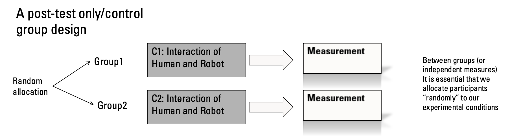
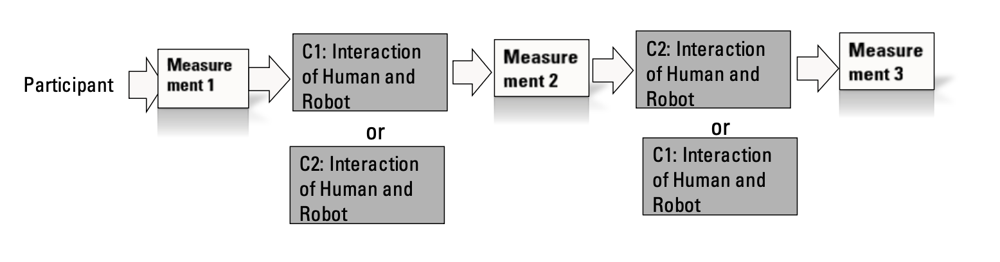
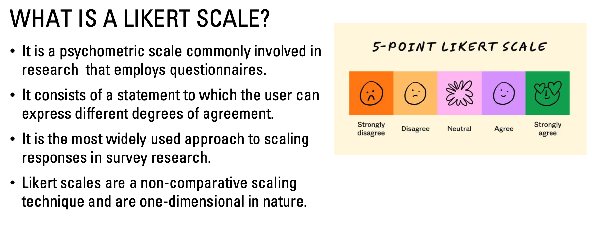
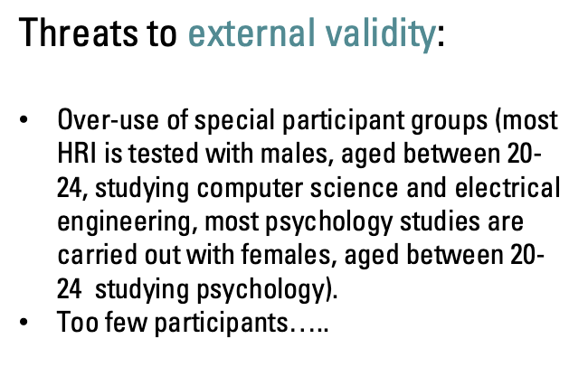
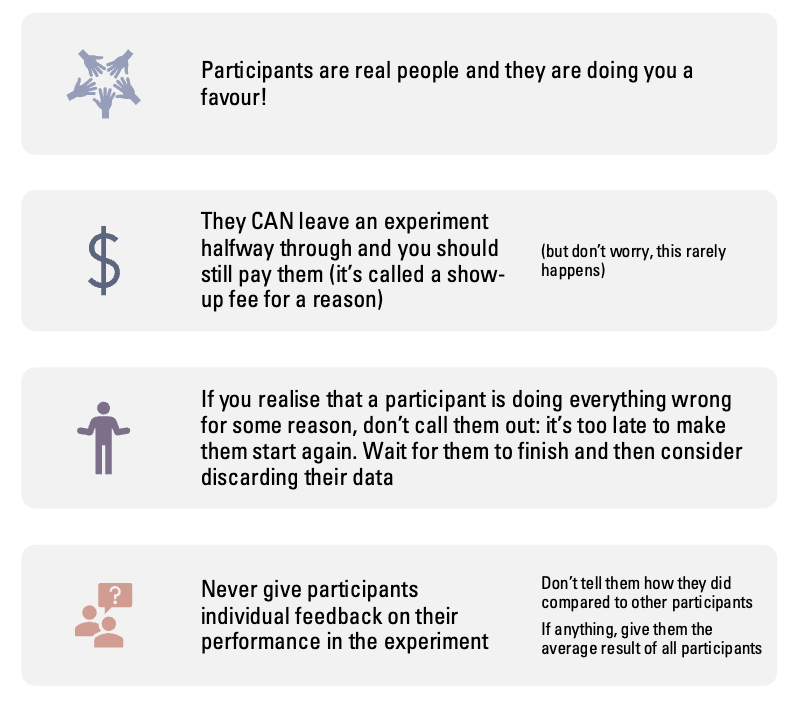

# Week 2 - Designing Experiments in HRI

# Experimental Design
Three types of studies we may conduct:
1. Study to collect data to use in the construction of a social robot;
2. Investigate the responses people give to social robots (even if the capabilities and features of such social robots do not exist yet);
3. Show that a technique built for a social robot has the desired effect in users.

You must always begin by defining:
- A **research question**;
- A **hypothesis**;
- **Variables** to measure;
- An **experimental design** appropriate to the question.

## Fiding the research question

Research questions emerge from:
1. Motivation & interest
2. Reading the literature
3. Identifying gaps (what hasn’t been studied)

The slides give 3 examples:

### Example 1 — Facial Features & Trust
- Lit review: facial anthropomorphism influences trust.
- Gap: effect of robot facial features (e.g., eyes) on trust was unexplored.
- **RQ: Do specific features in robot faces increase/decrease trust?**

### Example 2 — Robot Errors & Likeability
- Lit: faults/errors studied mostly for algorithms.
- Gap: impact of robot errors on likeability not studied.
- **RQ: Do robot errors influence likeability?**

### Example 3 — New Algorithm & Collaboration
- Lit: human–robot collaboration widely researched.
- Gap: the specific algorithm’s impact not studied.
- **RQ: Does algorithm X improve collaboration between humans and robots?**

## Hypotheses

A hypothesis is a theoretically grounded prediction about measurable outcomes.
It is **not a guess** — it must follow from literature.

**Examples:**

- H1: Robots with large eyes are perceived as more trustworthy than with small eyes.
- H2: A robot that commits errors is perceived as more likeable than a flawless robot.
- H3: A robot with algorithm X for animations will positively affect perceived collaboration.

>Each hypothesis must contain:
>- an independent variable (IV) → manipulated
>- a dependent variable (DV) → measured

## Variables 

A variable: any measurable characteristic in an experiment.

**Types of Variables**
- Numeric Variables: 
    - Discrete/count (e.g., number of errors detected, number of items picked up);
    - Continuous (e.g., distance to robot, time to complete task).

- Categorical Variables:
    - Binary (e.g., did participant reveal a secret: yes/no);
    - Ordinal (e.g., Likert scale);
    - Nominal (e.g., type of robot: humanoid / wheeled / virtual)

### Independent vs Dependent Variables 
| **Independent Variable (IV)**   | **Dependent Variable (DV)** |
| ------------------------------- | --------------------------- |
| “Cause” / manipulation          | “Effect” / outcome          |
| Changed intentionally           | Changes because of IV       |
| E.g., robot makes errors or not | E.g., Likeability rating    |
| Specific, controlled            | Measured through metrics    |

> Choice of Dependent Variables depends entirely on the research question and hypothesis.

## Type of Experiments

>You need conditions to compare → treatment vs control
>
>Example:
>- Condition 1: robot makes errors
>- Condition 2: robot does not make errors

### Quasi-Experimental Designs

Used often in early prototype testing but have major flaws.

**One-group post-test design**: Only one group. No comparison.
- Very weak validity.

**One-group pre-test/post-test design**: Measure before and after the interaction.
Better, but still:
- Cannot rule out external causes;
- Bad for causal inference.

**Problems**
- No control group;
- Weak ability to attribute effects to manipulation;
- External factors could influence results.

### Between-Subjects Design (Independent Measures)

Participants are randomly allocated to one condition each.
- Each participant experiences one condition.

**Advantages**
- Simple;
- No carryover effects(practice and fatigue);
- Good when participants cannot do all conditions.

**Disadvantages**
- Requires more participants;
- Individual differences can obscure effects.

**Two common variants:**
- Post-test only;

- Pre-test/post-test

### Within-Subjects Design

Each participant experiences all conditions.
>Counterbalancing:
>- Half participants: C1 → C2
>- Other half: C2 → C1

**Advantages**
- Requires fewer participants;
- High sensitivity (controls for individual differences).

**Disadvantages**
- Carryover effects;
- Conditions must be reversible.

### Mixed-Methods Design

Combination of:
- Between-subject variable;
- Within-subject variable.

>Useful for complex HRI experiments (e.g., robot type × scenario).

## Measures Used in HRI Experiments

### Explicit Vs. Implicit Measures

- **Explicit measures** relate to conscious impressions that people typically have time to reflect on:
    - E.g. questionnaire: “From 1 to 7, how safe did you feel…?”
    - E.g. interview: “Why did you feel safe…?”
    - E.g. informal brainstorming: “Would you or your grandmother use this feature if we added it to the robot?”

- **Implicit measures** refer to unconscious attitudes:
    - E.g. reaction times: How quickly does someone click on the word “safe” after seeing a picture of a robot? (IAT)
    - E.g. behaviour: Are people smiling / looking uncomfortable?
    - E.g. engagement: Are people using a product’s feature at all? Are people willing to interact with the system?

>Note:
>- Keep in mind that unfortunately attitudes (survey responses) don’t always correlate with behavior!
>- There is a difference between words and actions.
>- People say they would 100% trust a system ≠ people actually trusting the system. 
>- So what to do? A **mix of explicit and implicit is good** and gives you a bigger picture. 

### Task Metrics
Often we want to measure the performance of the robot and the user in a task.
- Robot task metrics (navigation accuracy, number of interventions);
- Human task metrics (speed, errors, completion time);
- Team metrics (human + robot).

For example we can use Efficiency as task metric using time needed to complete the task. Measuring:
- task completion time;
- number of user interventions;
- ratio of human to robot time.

### Physiological Measures

Like: 
- Heart rate & blood pressure
- Galvanic skin response (GSR)
- Hormone levels
- fMRI

Challenges:
- Expensive equipment;
- Signals noisy or ambiguous;
- Hard to link changes to specific robot manipulations.

### Self-Reported/Explicit Measures

Highly common but subjective.

**Types:**
- Yes/No;
- Likert scales (1–7, strongly disagree → strongly agree).

**Problem**
- Participants’ **words != actions**. Explicit attitudes often differ from behavior.

>Always combine **explicit + implicit measures**.

## Standardized HRI Questionnaires

Using **validated questionnaires** ensures comparability.

### Almere

The Almere model is a technology acceptance model: it can be used to predict and explain usage of a system by  observing the **influences on the Intention to Use** this system. 

**Dimensions:**
- Anxiety; 
- Attitude; 
- Perceived Enjoyment; 
- Perceived sociability; 
- Perceived usefulness;
- Social influence;
- Social presence.

### Goodspeed

A classic measure in HRI. Likert scale- based questionnaire used  to measure users’ overall perceptions of robots.

Made of **subscales**:
- Anthropomorphism;
- Animacy;
- Likeability;
- Perceived intelligence;
- Perceived safety.

### RoSAS

8-item scale (The Robotic Social Attribute Scale; RoSAS) to Measure people’s judgments of the social attributes of robots.

3 Factors:
1. Warmth;
2. Competence;
3. Discomfort.

### MDMT(Multidimensional Measure of Trust)

**Trust** = a dyadic relation in which one person accepts vulnerability because they expect that the other person’s future action will have certain characteristics; these characteristics include some mix of performance (ability, reliability) and/or morality (honesty, integrity, and benevolence).

Measurement MDMT includes these  two types of trust:
- performance trust in human-robot interaction
- moral trust, based on the notion that the system may or may not act morally.

>YET
>- Very often we cannot find differences in these subjective measures.
>- So, it is important to also ask directly the impressions that participants have.
>- Plus, these subjective measures depends on the scenario chosen.

## Situating the experiment in the scientific world

### Reliability
Yielding the same or compatible results in different experiments or statistical trials.

Achieved by:
- precise measurement
- standardized procedures
- minimizing randomness

### Validity
#### Internal Validity
If the results obtained are not due to the manipulation, but rather to some other factors, then the study lacks internal validity. To get validity a good experimental design must be created.

#### External Validity
If the results obtained are general for humanity, (and not rather valid for the specific situation).

## Running an experiment

### First: Ethical, Legal, and Safety Requirements
Before running any experiment, you must have:
#### Ethics Approval:
- Required by your institution or ethics board.
- Must include:
    - Research question
    - Study protocol
    - Risks + how they are mitigated
    - Recruitment procedures
    - Consent procedure
    - Data protection measures

#### Legal and Safety Concerns

Usually before running any study involving humans and robots that will be interacting physically, certain legal, safety and ethical issues need to be considered.
- Ethical Approval (many organisations require an Ethics Committee to give approval for any research done with humans);
- Creation of a study protocol 
- The Ethics committee must look into:
    - Privacy of the data (videos, photos, records must be kept private);
    - Protection of minors and vulnerable adults;
    - Mental or emotional stress and humiliation;
    - Physical harm.

#### Participants

- **Respect your participants**: you are representing your university and they are real people, they have rights!
- **Protect your study variables** do not influence participants on how you would like them to behave;
- **Protect your sample**! If you bring friends do not tell them in advance the aim of the study or you will be manipulating your results!

>In online surveys: they will also be working (even in online studies);
>Often attention checks are needed to guarantee the participants are engaged with the experiment.

Essential to ensure **generalizability**. You must collect:
- Age
- Gender (recommended: male / female / non-binary / self-describe / prefer not to say)
- Language proficiency
- Relevant experience (e.g., robotics knowledge)

>These variables help analyze whether results generalize to wider populations.

### Minimize Bias

The participants are eager to please the evaluator, if they think the evaluator wants them to answer in a certain way, they will answer accordingly. **We need to nee to check the questions we ask! Are they biasing?**
Example:
- ~~“I enjoyed interacting with the robot";~~
- ~~“I did not enjoy interacting with the robot”;~~ 
- Please rate your experience with the robot".

Another important aspects:
- Don’t tell participants what your manipulation is before the experiment(you should tell them afterwards, in a debriefing);
- Ideally, if participants are randomly allocated to  conditions, you should also not know what condition one participant is in;
Wait outside the room where the experiment is running;
- Consider having 50% participants do the experiment  with a male experimenter, 50% with a female experimenter.

### Minimize Noise 

Noise is everything we can't controll in a experiment, like:
- how participants are feeling on that particular day.
- how hot it is.
- participants’ personality...
>Our goal is to keep as much of this noise as we can under control.

We should:

- Keep the **environment** constant(Lightting, computer orientation, audio levels, device calibration).
- Keep **"yourself"** constant(Make a little “script” and always use it when greeting participants; Think about what questions participants might ask you before the experiment, and be ready to always answer them in the same way; Don’t read / recite the instructions, put them on a screen / printout and let participants read them; Automate as much as possible).

### Online Experiments

HRI research can also be conducted online!

**Mturk:**

- Pros: widely used, you can have hundreds of partcipants overnight. 
- Cons: run by big corporations, is criticised for unfair treatment of participants.

**Prolific:**

- Pros: higher quality data, it is made specifically for research.
- Cons: less widely used.

