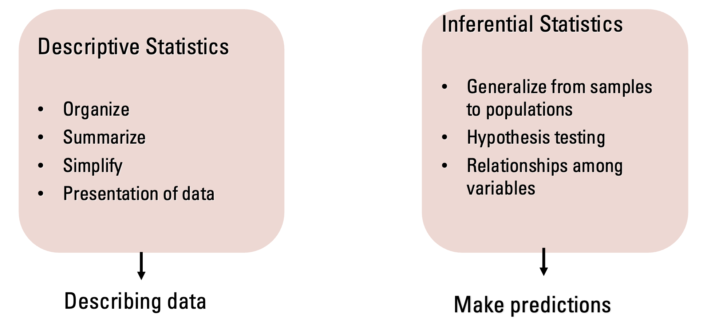
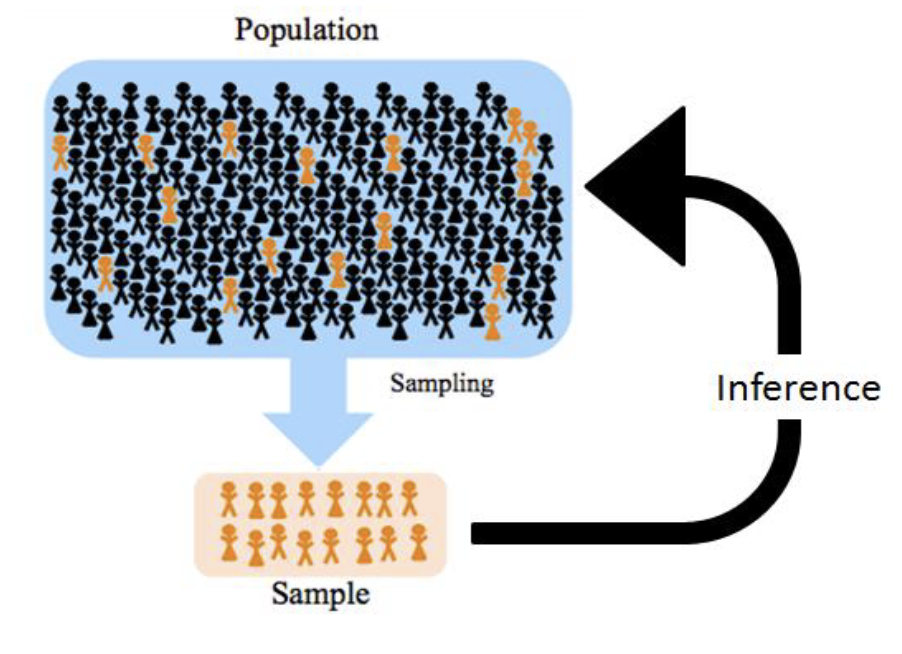
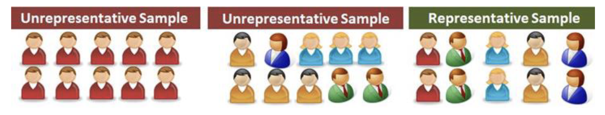
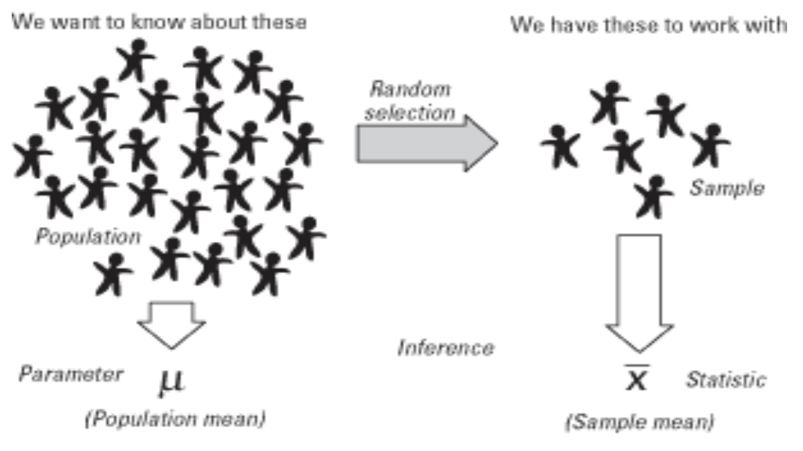
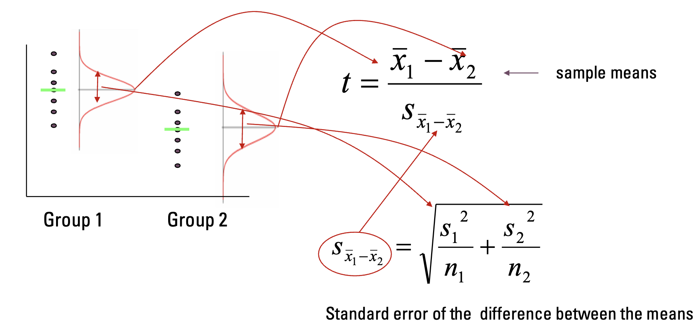
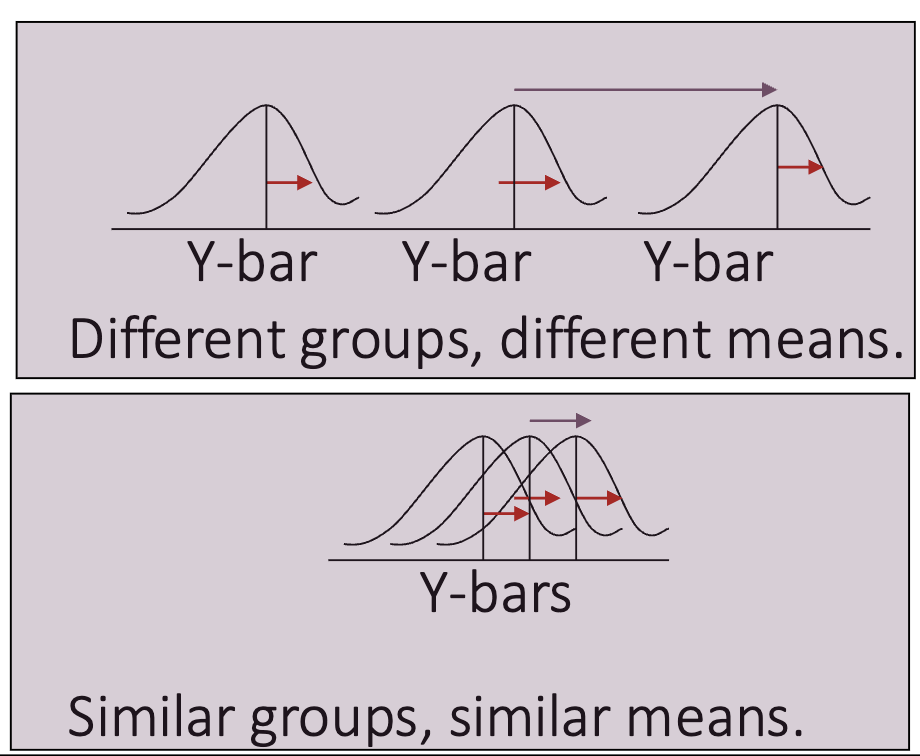
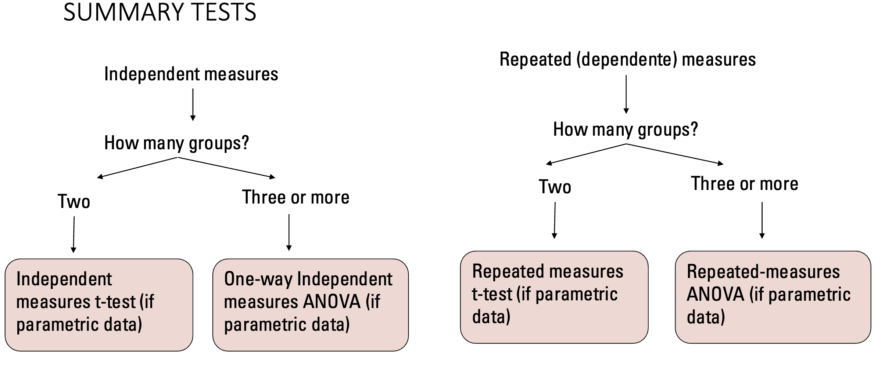
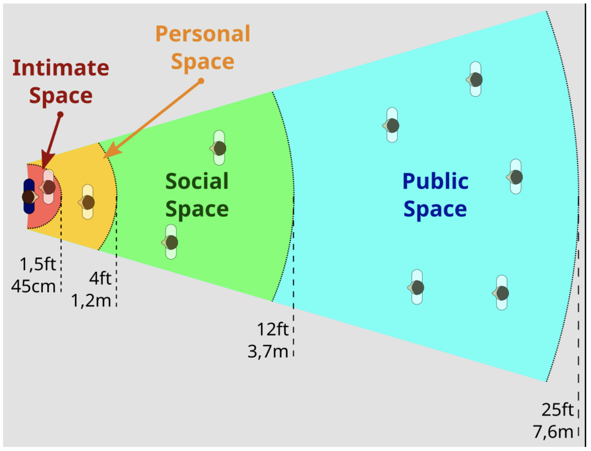
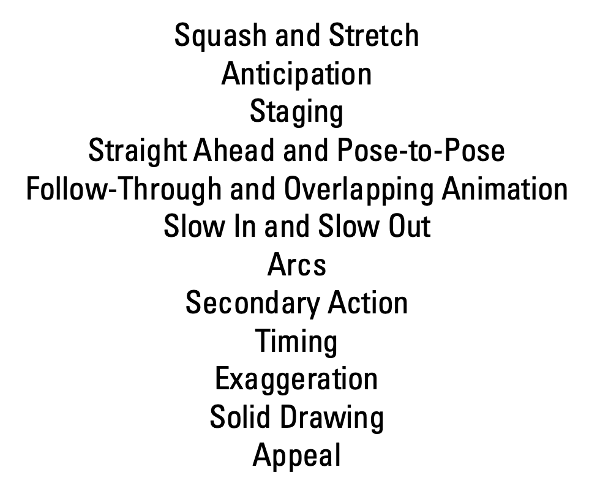
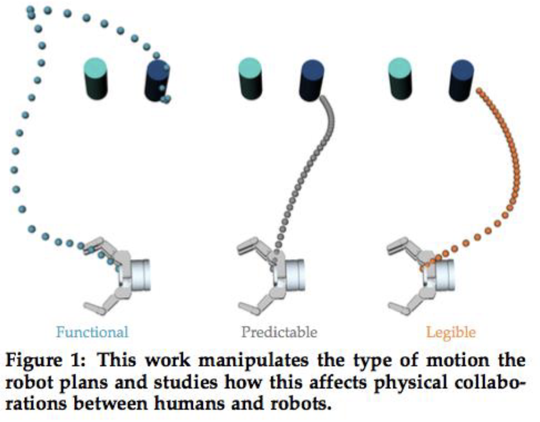

# Week 3

## 3.1. Statistical Analysis

### Fundamentals of Statistics

**Why do we need statistics?** To answer research questions and **test hypotheses** by generalizing from a sample (what we test) to a population (everyone).

#### Descriptive Statistics: 
Summarize and organize data. Tell us about the “population and the distribution of the results”.
- **Mean ($M$):** Average score.
- **Median ($Mdn$):** Middle score when ranked.
- **Sum of squared errors (SS)**.
- **Variance ($s^2$):** Average squared deviation (how much data differs from the mean). Average squared deviation between the mean and the observed score.
- **Standard Deviation ($SD$):** Square root of variance.

>We are interested not only  in statistics that  describe the population sample but also in  statistics that allow us to “infer” things about the  users in the groups (the conditions)  interacting  with our social robots: we need **inferential statistics**.

#### Inferential Statistics
Allow us to make predictions (inferences) about the population based on the sample.

>If the **sample is representative** of the whole population, then our results on the sample should apply to the whole population (e.g. if the food is not stirred, and you taste from the bottom of the pot, the sample is not representative).
>

- **Parameter:** Value that describes the population (usually unknown).
- **Statistic:** Value that describes the sample (measured).

>**Sampling: Issues when making inferences:** The data collected represents only a single sample from a much larger population. So... if a different sample were used, then different results could have been obtained....

#### Hypothesis Testing
*“to prove that the results in the sample population that we observe of 
one condition is different from the other condition”*.

- **Null Hypothesis ($H_0$):** Assumes no difference or effect exists.

- **Alternative Hypothesis ($H_1$):** Assumes there is a difference.

**The Goal:** Calculate the probability that the result is due to chance. If the probability is low enough, we reject $H_0$.

##### Test statistics
A test statistic is a ratio that compares the **systematic variation** (the effect of our experiment) to the **unsystematic variation** (random error or background noise). A larger test statistic suggests the experimental manipulation had a real effect.

$$ \text{Test Statistic} = \frac{\text{Systematic Variance (Effect)}}{\text{Unsystematic Variance (Noise/Error)}} $$

### T-test: comparing two groups

Used when you have one Independent Variable with only two levels (e.g., Condition A vs. Condition B). The T-test is a specific calculator used to compare the averages (means) of exactly two groups.

#### Independent T-Test
- Between-groups design (different people in each group). 
- Compares the means of two independent groups.
- **Challange:** Because the people are different, maybe Group 1 was just happier naturally. The math has to account for that "noise."

#### Dependent(Paired) T-Test
- Within-subjects design (same people in both conditions).
- Compares difference scores ($D=X1−X2$​) of interaction with condition for each individual of the sample.
- **Advantage:** It removes the "noise" of individual personality.

#### Assumptions 
- **Normality:** Data follows a normal distribution (bell curve).
- **Interval Data:** Data is measured at least at the interval level.(1-100 not Yes/No)
- **Homogeneity of Variance (Independent T-test only):** Variances in both groups are roughly equal.

#### Limitation 
The T-test handles only two groups(Two levels of IV). If you have 3 or more, you must use ANOVA.

### Analysis of variance (Anova): Comparing More Than Two Groups

he T-test cannot be used for 3+ groups (or levels). Instead, use Analysis of Variance (ANOVA).

It only indicates that there is a difference somewhere. It does not tell you which specific groups differ

#### Assumptions of Anova

- Each group distribution must be approximately normal.
- Standard deviations of each group are approximately equal.

#### F-statistic

$$ \text{F} = \frac{\text{Variance Between Groups}}{\text{Variance within Groups}} $$

To see exactly which groups differ (e.g., Robot A vs Robot C), you must do pairwise comparisons(using the 2-sample t test).
- **Warning:** Doing many comparisons increases the risk of false positives. You must use corrections (e.g., Bonferroni, Tukey’s HSD).

#### Types of ANOVA:
- **One-way ANOVA:** Multi-group equivalent of Independent T-test.
- **Repeated-measures ANOVA:** Multi-group equivalent of Dependent T-test.
- **MANOVA:** Used when testing more than one Dependent Variable.

>If your data is not normally distributed or violates homogeneity of variance, you cannot use T-tests or ANOVA. You must use Non-Parametric tests.

**How to check assumptions:**
- Normality: Kolmogorov-Smirnov or Shapiro-Wilk tests.
- Homogeneity: Levene's or Bartlett's tests.

### Significance and Errors 

**Significant** = probably not caused by chance for a given significance level, but rather caused by a factor of interest (your manipulation).

#### P-Values
The probability that the observed result occurred by chance if the Null Hypothesis ($H0$) is true.

It has a **Gold Standard** of 0.005(5%):
- $p \le 0.05$: Result is **Significant** (Reject $H_0$, accept $H_1$).
- $p > 0.05$: Result is **Not Significant** (Fail to reject $H_0$).

#### Errors
1. **Type I error(False Positive):**
- We conclude there is an effect when there is none, rejected $H_0$ when is true. It is caused by **unusual, unrepresentative samples.**
2. **Type II error(False Negative):**
- We conclude that there is no effect when there is actually one, failed to reject $H_0$ when it is false. It is caused by a **very small manipulation effect**.

>The hypothesis test is influenced not only by the size of the manipulation 
effect but also by the **size of the sample** (Power analysis / sequential analysis). Large samples increase "Power." A very small effect can become statistically significant if the sample size is huge.

### How to Report a Study
1. **Motivation:** Research question and Hypothesis.
2. **Methods:**
    - Subjects/Materials (Who/What).
    - Setting (Equipment).
    - Procedure (Chronological sequence of events).
3. **Results:**
    - Descriptive stats (Means/SD) + Inferential stats (P-values/Test stats).
    - Visuals (Graphs/Tables).
4. **Discussion:**
    - Interpret the results (don't just repeat numbers).
    - Compare with hypothesis.
    - Identify sources of error and suggest future improvements.

## 3.2. Motion and Animation

**Problem:** How to automatically generate  physical actions in a robot that are not only **effective at performing a task** but also **expressive** enough to convey intention and social attitudes, be **safe and transparent**, supporting the social role the robot plays.

1. **Effective**: Successfully perform the task.
2. **Expressive**: Convey intention, social attitude, and character (supporting the social role).
3. **Safe/Transparent**: Be safe for humans and easy to understand.

### Types of Embodied
- **Functional:** Task oriented (e.g. Drones, vacuums).
- **Artifact-shaped:** Object inspired(e.g. smart luggage), Apparatus-inspired(e.g. cars).
- **Bio-inspired:** Inspired in nature can be, humanoids, androids, animal-inspired...

### Motion Properties
1. **Speed** – may convey urgency, calmness, confidence,....
2. **Acceleration / Deceleration** – smooth vs abrupt dynamics influence safety & naturalness
3. **Amplitude** – large vs small movements can signal dominance, enthusiasm, or shyness
4. **Rhythm & Timing** – synchrony, pauses, conversational timing affects rapport
5. **Trajectory Shape** – arcs = friendly/natural; straight lines = mechanical/efficient
6. **Smoothness / Jerk** – smoother motion increases trust and perceived competence
7. **Posture & Orientation** – body/face direction communicates attention & intent
8. **Repetition & Variability** – small variations create lifelike, non-mechanical behaviour
9. **Expressive Modulation** – emotional tone through tempo, tension, flow

### Navigation in social settings

Navigation in social environments requires the use of **Proxemics** - study of social space and how it affects the population.
- We should respect the intimate, personal and public spaces.

#### Rules of Social Navigation

- **Approach**: Do not approach from behind. Use "soft" trajectories (curves), not straight lines. Approach at a 30-45° angle (not head-on). Stop at a Social distance, if possible greet.
- **Following**: Match human walking speed; don't get too close.
- **Guiding**: Move slowly, frequently orient/look back at the human, wait if they stop.
- **Passing & Crossing**: Move slowly and predictably when close to humans.

### Designing Expressive motion
Based on the "Illusion of Life" (Thomas & Johnston), these animation principles help robots appear to "think" and act on volition.

#### Key principals are:
1. **Squash and Stretch:** Giving an object "liquid" qualities to show life. Hard for robots due to rigid bodies, but implies maintaining volume during movement.
2. **Anticipation:** A movement before the main action (e.g., pulling back before throwing). Crucial for robots so humans can predict what they will do next.
3. **Staging:** Presenting an action clearly so the intention is unmistakable.
4. **Arcs:** Natural organisms move in arcs (curved paths). Robots usually move in straight lines (Inverse Kinematics), which looks mechanical.
5. **Secondary Action:** Gestures that support the main action to add life (e.g., scratching a head while thinking).
6. **Exaggeration:** Emphasizing a movement to make it more noticeable and convincing.
7. **Timing:** The speed of an action defines the "weight" and emotion of the character.

### Safety in Motion

Since social robots share space with humans, collisions are a risk. Too high energy/power may be transferred by the robot, resulting in serious human damages.

#### Mechanical Design:
- Eliminate sharp edges.
- Use lightweight, stiff materials.
- Compliance: Soft coverings (foam/skin) or compliant joints (springs) to absorb impact.

#### Sensing/Control:
- External/Internal sensors to detect proximity.
- Software that anticipates collisions.

#### Case Study: Baxter

A robot designed for factory collabpration.
- **Software Control:** Baxter is designed to **slow or stop upon inadvertent contact**, allowing it to work collaboratively or to be co-located with an operator in close proximity.
- **Multiple Redundant Systems:** Baxter has a **wide array of innovative sensors** and an emergency stop function to ensure safety.
- **Lightweight, Compliant Materials:** Baxter’s arms weigh less than 20 kg, are fully covered in compliant plastic, and use protective foam at key joints.
- **Dynamic Breaking:** Baxter will slowly come to rest in the event of a power loss or an E-stop.
- **Human Awareness:** Baxter can recognize human proximity with its 360° **sonar system**, which signals its awareness of any detected nearby people.

### Predictability, Legibility, Intention and Collaboration
- **Functional Motion:** Just gets the job done (avoids collisions, reaches goal).
- **Predictable Motion:** Matches what the observer expects.
    - Logic: I know the robot wants the green bottle → I expect it to move in a straight line.
- **Legible Motion:** Allows the observer to infer the intent quickly.
    - Logic: The robot is curving right → It must want the bottle on the right (even before it gets there).

> **Conflict:** Predictability and Legibility are often contradictory. Example: If there are two bottles side-by-side, a straight line is "Predictable" (most efficient), but a curved arc is "Legible" (it clarifies which bottle is the target earlier in the movement).

> #### Studies conducted:
>
>**Hypothesis:** Legible motion is better for collaboration than functional or purely predictable motion.
>- **Legible** motion reduced "Coordination Time" (humans understood the goal faster).
>- Legible motion was rated higher for **Trust, Intelligence, and Fluency**.
>- **Functional** motion (pure efficiency) was rated the worst for collaboration.

