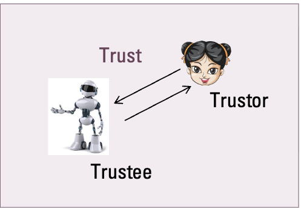
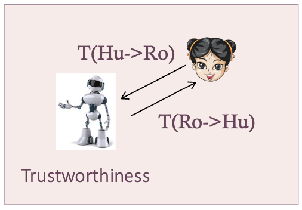
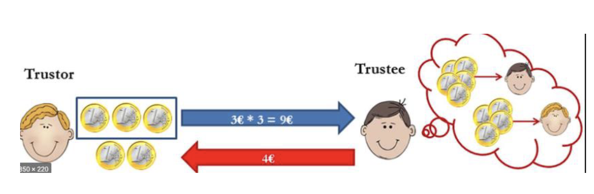
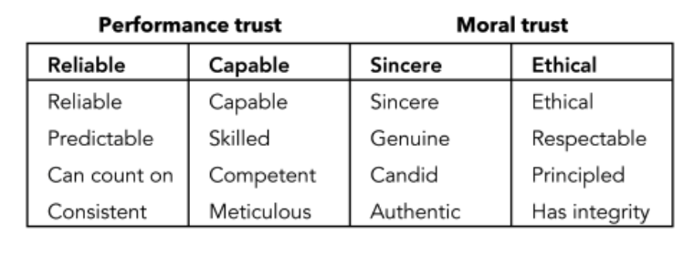
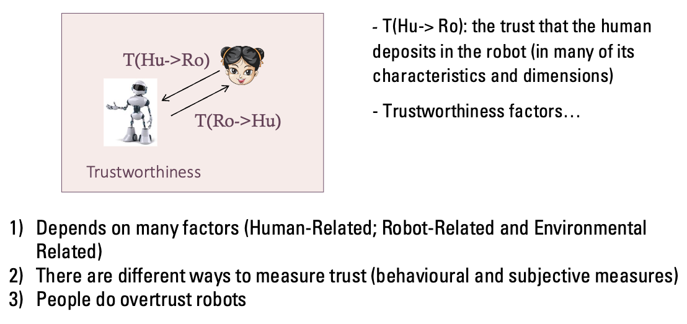

# Week 4 - Trust in HRI

## Trust 

### Why? 
- It is central to interpersonal relationships.
- It is crucial in situations involving risk, uncertainty, or interdependence.
- There are significant individual differences in how people trust.

### What?

- **Sociologists:** View trust as a social structure.
- **Economists:** View trust as an economic choice mechanism.
- **Computer Scientists:** View trust as a feature in a system.

Authors define trust as:
- Lee et al.: "Trust **is the attitude** that others will help achieve an individual's goals in a situation characterized by uncertainty and vulnerability."
- Hancock et al.: "Trust is the **reliance** by someone that actions prejudicial to their well-being will not be undertaken by influential others."

Trust is in the **attitude/relation** (of the trustor towards the trustee).

- Trustor: The entity doing the trusting (usually the human).
- Trustee: The entity being trusted (the robot/AI).

### What leads to trust?(trustworthiness)
- **Competence:** is the trustee competence in performing the actions effectively?  
- **Reliability and safety:** is the trustee reliable and will do the task in a safe way?
- **Predictability:** is the trustee competence in performing the actions according to the expectations?
- **Benevolence:** is the trustee intrinsic and positive intentions towards the trustor?
- **Integrity:** is trustee’s adherence to a set of principles that are acceptable to the trustor? (Honest; Credible; Reliable; Dependable)
- **Fairness:** is the trustee fair in its responses and judgements to the trustor?
- **Transparency:** is the trustee transparent about its decision and responses to the trustor?
- **Privacy and security:** will the information given to the trustee remain private and secure?
- **Accountability & Governance:** who will be responsible if the trustee (AI)  fails? 

#### Requirements for trustworthy AI
- **Human agency and oversight**: Including fundamental rights, human agency and human oversight
- **Technical robustness and safety**: Including resilience to attack and security, fall back plan and general safety, accuracy, reliability and reproducibility
- **Privacy and data governance**: Including respect for privacy, quality and integrity of data, and access to data
- **Transparency**: Including traceability, explainability and communication
- **Diversity, non-discrimination and fairness**: Including the avoidance of unfair bias,  accessibility and universal design, and stakeholder participation
- **Societal and environmental wellbeing:** Including sustainability and environmental  friendliness, social impact, society and democracy
- **Accountability**: Including auditability, minimisation and reporting of negative impact,  trade-offs and redress

## Trust in HRI

- T(Hu -> Ro): The trust the Human deposits in the Robot (Focus of this lecture).
- T(Ro -> Hu): The trust the Robot has in the Human.

For T(Hu->Ro):
- **Competence:** is the robot competent in performing the required actions effectively?  
- **Reliability and safety:** is the robot reliable and will do the task in a safe way?
- **Predictability:** is the robot’s actions according to the expectations?
- **Benevolence:** is the robot’s designed actions be based on positive intentions towards the trustor?
- **Fairness:** is the robot fair in its responses and judgements to the human?
- **Transparency:** is the robot transparent about its decisions and actions towards the human?
- **Privacy and security:** will the information given to the robot remain private and secure?
- **Accountability & Governance:** who will be responsible if robot fails? 
- **Embodiment:** is the embodiment of the robot conductive of trust?

People are different and context matters, the relevant human factors are:
1. **Disposition to Trust in a robot:** the extent to which a user  displays a consistent tendency to be willing to depend on the robot across a broad spectrum of situations. 
2. **Situation-based Trust:** the user believes the needed conditions are in place to enable his/her to anticipate a successful outcome by the robots’s actions
    - Other factors: Risk conditions and Reputation

#### **Case Study 1: Salem et al. (2015) - "Would you trust a (faulty) robot?"**
-   **Goal:** To see how robot mistakes affect trust and compliance.
-   **Scenario:** A home setting. A robot assistant helps the participant (Welcome, Music, Setting the table).
-   **Variables:**
    -   **Performance:** Correct (C) vs. Faulty (F). The faulty robot took wrong paths and played the wrong music.
-   **The Test (Unusual Requests):** The robot asked the human to do strange things:
    1.  Throw away letters (not trash).
    2.  Pour orange juice on a plant.
    3.  Use a password to access a laptop.
    4.  Disclose personal secrets.
-   **Results (Subjective):** People rated the Correct robot as *more* trustworthy and reliable.
-   **Results (Behavioral):** **Surprising!** There was **no significant difference** in behavior.
    -   Most people (90% for letters, 75% for juice) followed the robot's instructions *even when the robot was faulty*.
    -   They complied with the "unusual requests" regardless of the robot's previous errors.

**Why?** Participants rationalized the robot's behavior ("The plant must be dry") or felt they were not liable.
 
## The Problem of OverTrust

- **Calibrated Trust:** Trust matches the system's actual capabilities (Ideal).

- **Over-trust:** Trust > System Capabilities.
    - Consequence: Misuse (using it when you shouldn't).

- **Distrust:** Trust < System Capabilities.
    - Consequence: Disuse (ignoring it when it could help).

**Takeaway:** Humans have a dangerous tendency to over-trust robots, especially in emergencies or when the robot acts with authority, even if the robot has proven to be incompetent.

#### **Case Study 2: Robinette et al. (2016) - "Emergency Evacuation"**
-   **Goal:** Investigate trust in high-risk (emergency) situations.
-   **Scenario:** A robot guides a student to a room.
-   **Conditions:**
    -   *Efficient:* Robot takes the direct path.
    -   *Circuitous:* Robot gets lost, goes in circles, enters wrong rooms.
-   **The Emergency:** Artificial smoke fills the hall. The robot attempts to guide the human to a back exit (potentially dangerous or unknown) instead of the known safe exit.
-   **Hypothesis:** People would follow the Efficient robot but reject the Circuitous (broken) robot.
-   **Results:** **Hypothesis Failed.**
    -   **100% (All 26 participants)** followed the robot in the emergency.
    -   Even those who saw the robot fail miserably just minutes before still followed it into a potential fire.

**Conclusion:** In emergencies, humans tend to **Over-trust** robots.

## How to measure trust

They can be:

1. **Behavioral Measures**: Based on observation of actions. Does the user follow the robot's instructions?
    - Example: **Trust game**
    

2. **Subjective Measures**: Measured by questionnaires and scales.
    - **MDMT (Multi-Dimensional Measure of Trust) by Malle & Ullman:** Distinguishes betweem Performance Trust (Reliable, Capable) and Moral Trust (Sincere, Ethical).
    
    - **Trust Perception Scale-HRI(SChaefer):** A psychometrically validated, 40-item instrument that measures human trust in robots by assessing their perceived **capability, behavior, task performance, and physical appearance**.

## Summary

