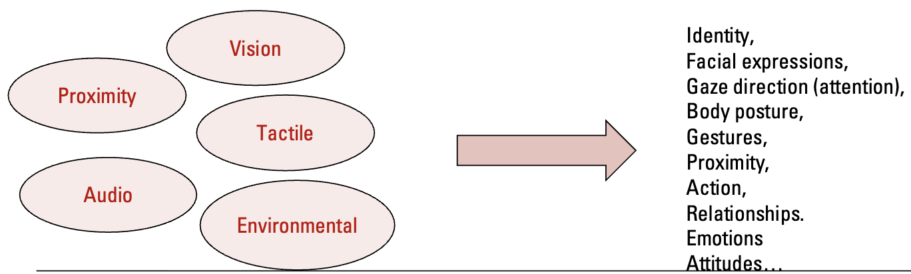
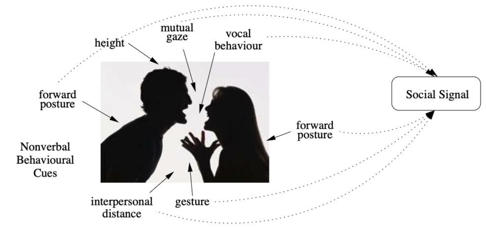
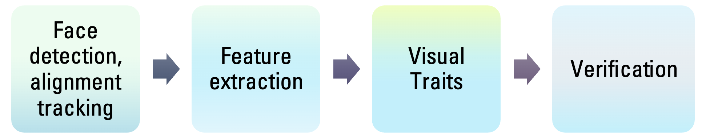
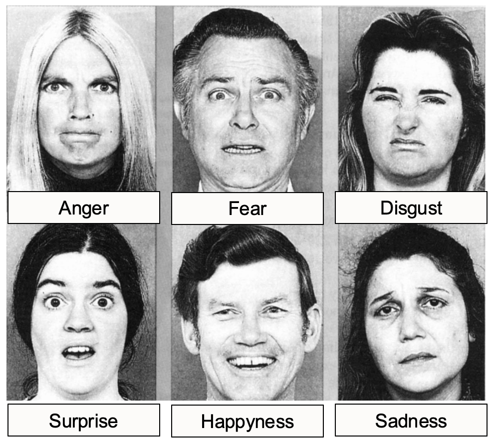
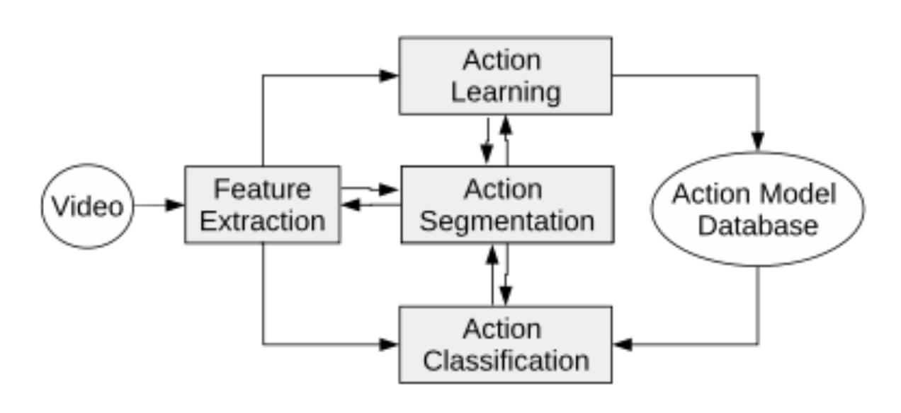
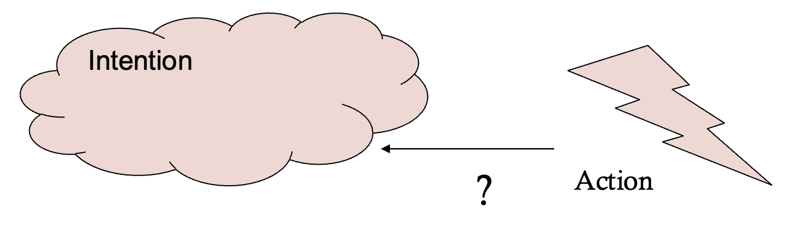
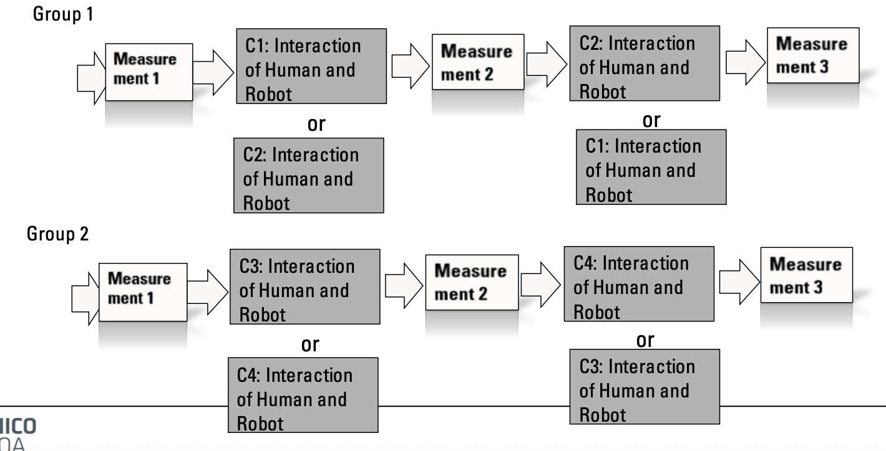

# Week 5 - Social Perception

## Social robots

**Definition of a Social Robot (Duffy, 2003):** A physical entity **embodied** in a complex, **social environment**, **empowered to achieve goals** (its own and the community’s), and **capable of recognizing** others and engaging in social interactions.

### Central Problem:
Robots have **limited perceptual capabilities** compared to humans, yet they must build technology to understand complex social situations, affective states, and intentions to respond appropriately.
- **The Sensor Gap:** The human body has hundreds of millions of sensors. Even advanced humanoid robots (like the Unitree G1) only have about 120–150 sensors.

## Embodiment and Sensing

Robotic sensors can have many types: assive versus active sensors; simple versus complex sensors; exteroceptive versus proprioceptive sensors
1. **Exteroceptive (External Perception):**
    - Vision: Cameras (2D/3D) for object/face ID.
    - Range: LiDAR, Sonar, IR for distance.
    - Tactile: Touch/pressure sensors.
    - Audio: Microphones.
    - Thermal: Can detect stress via skin temperature.

2. **Proprioceptive (Internal State):**
    - Motion/Position: Gyroscopes (orientation), Accelerometers (tilt/speed).
    - Positioning: GPS.

## Social Perception

In humans, social perception is how to form impressions, representations and make inferences about others (humans). It is how to perceive and understand individuals and groups in a social context.
How to go from sensors to understanding of individuals (humans) and groups in a social contex?

### Social Signal Processing (SSP): 
The goal is to analyze nonverbal cues (face, gaze, gestures, tone) to build socially intelligent machines.

### Key Perception modalities

#### A. Face Detection and Recognition:

- **Face detection, alignment & normalization:** Techniques are used to geometrically normalize the face (e.g., center the eyes, adjust the head tilt) before feature extraction.
- **Extract Features:** For each face image low-level features are extracted (for example normalized pixel values, image gradient directions) these vectors to form a large feature vector F(I).
- **Visual Traits:** For each extracted feature vector, “trait vector”  are built for the face. These classifiers may be focused on attributes such as gender, age, and race, which provide strong cues about a person’s identity.
- **Verification:** To decide if face matches one already in the system (calculating if the new user is he same person, can be done by comparing their trait vectors using a final classifier D).

#### B. Voice Recognition and Analysis:
- **Speaker Recognition (Who):** "Voice Biometrics." Identifies the person.
- **Speech Recognition (What):** Transcribes the words.

Vocal Features:
- **Pitch (F0):** Vocal cord vibration speed.
- **Prosody:** Rhythm, stress, intonation.
- **Non-linguistic signals:** Laughs, sighs, cries.

#### C. Emotion Recognition:

  **Paul Ekman:** Pioneer in facial expressions. Proposed the **Universality Hypothesis**.
  
-    **The 6 Basic Universal Emotions:** Anger, Fear, Disgust, Surprise, Happiness, Sadness.
-  **Evidence:** Studies in 5 cultures (US, Japan, Brazil, etc.) and the **Fore tribe in Papua New Guinea** (who had no exposure to Western media) showed high accuracy in recognizing these faces.
-   **Duchenne Smile:** A "true" spontaneous smile involving specific eye muscles (perceived as trustworthy), versus a polite/fake smile.

**Measuring Expressions: FACS (Facial Action Coding System)**
*   A taxonomy of **44 Action Units (AUs)**. Codes muscle movements (binary or intensity). FACS measures *movements*, not emotions directly, though patterns of Action Units (AUs) map to emotions.

**Criticisms & Limitations:**
1.  **Lisa Feldman Barrett:** Argues emotions are not universal or discrete; they are constructed concepts.
2.  **Decontextualization:** Algorithms often analyze faces in a vacuum, ignoring context.
3.  **Bias:** Models trained on light-skinned faces perform poorly on others.
4.  **Regulation (EU AI Act):** Prohibits emotion recognition in **schools** and **workplaces** (monitoring engagement/attention is banned).

#### D. Gaze and Posture:

- **Gaze:** Critical for attention and "mutual gaze" (looking at each other). Tools like OpenFace track gaze vectors.
    - Body Analysis: Tools like OpenPose and MediaPipe detect "keypoints" (skeleton tracking) from nose to toes.

#### E. Gestures:

They can be categorized as:
- **Emblems:** Direct translation to words (e.g., Peace sign, "The finger"). Culture-specific.
- **Illustrators:** Accompany speech to visualize it (e.g., "The fish was this big").
- **Regulators:** Coordinate conversation flow (e.g., Nodding, looking away).
- **Self-adaptors:** Unconscious release of nervous energy (e.g., Touching hair, biting lips).

#### F. Human Body Analysis:
Focused on detecting and localizing key body features, from the nose to the toes, in images or video inputs. The goal is to accurately identify the position and orientation of a person’s body within a scene. 

## Action and intention Detection

Actions are Spatio-Temporal patterns (movement over time).
- Challenge: Differentiating simple movement from complex "Human-Object Interactions" (e.g., Using a drill vs. holding a drill).

We want to  figure out the action of the user and also, “why” the user is performing that action. **Problem: Limited datasets**.

### Theory of mind

**Definition:** Theory of mind is the ability to understand that other people have their own thoughts, beliefs, and emotions, which may differ from your own. It is central to social interaction and empathy.
- **Predicting behavior:** to anticipate what someone will do based on what we think they know or believe. 
- **Perspective-taking:** Theory of mind helps us recognize that others don’t share all of our knowledge or experiences, and can act differently, especially if they see the situation from a different angle. 
- **Inferring intentions:** to interpret the motives behind people’s actions. 

#### Robotic Application

Robots use ToM to infer intention. They use **"Simulation Theory"**, simulating the human's perspective to predict what they will do next.

### Current Trends for action detection

**Multimodal Learning:** Combining text, audio, visual, and spatial data.

- LMMs (Large Multimodal Models): Examples like Google Gemini.
- These models can reason about video content (e.g., interpreting a child's shift from smiling to confusion and back to joy based on visual cues).

The Data Challenge:
- AI growth is driven by exponential increases in data points (see GPT-4 vs. Perceptron).
-   **Robotics Challenge: We need massive datasets of robots acting in the real world to train them effectively (e.g., The "Neo" robot approach).**