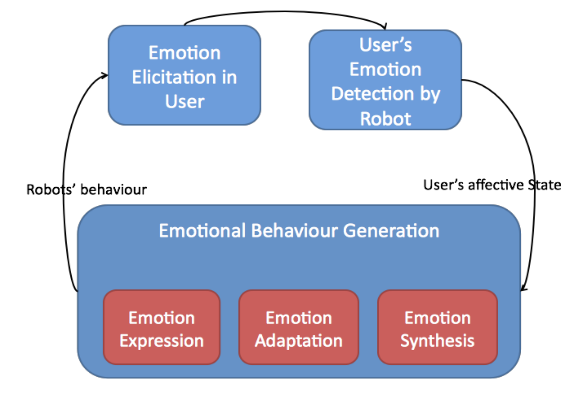
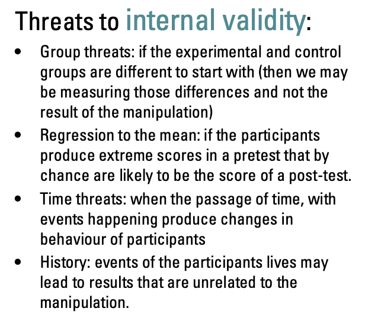
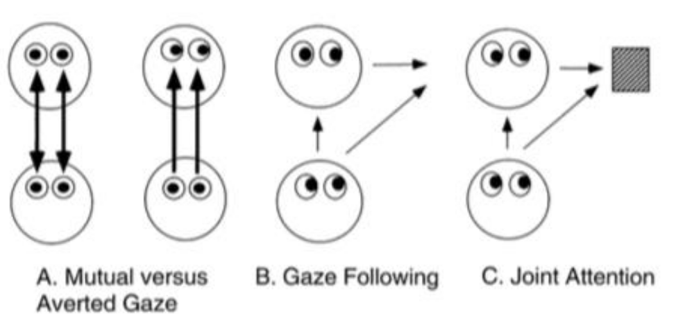
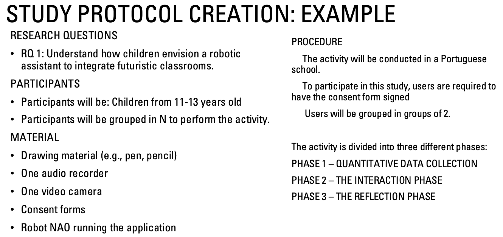
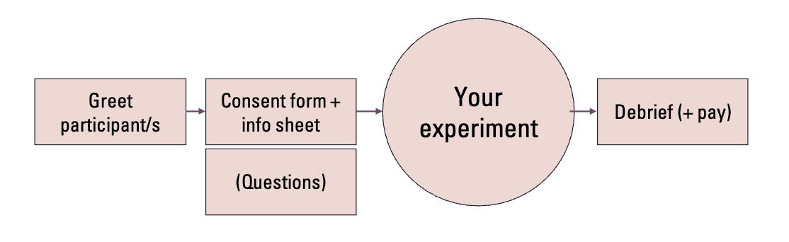

# Week 6 - Emotions and Non-verbal behaviour in HRI

## Can we feel emotions towards robots?

#### **Study 1: The "Torture" Experiment (Rosenthal-von der Pütten et al., 2013)**

- **Hypothesis:**
    - (H1a) People will feel more negative affect watching a robot being tortured compared to treated nicely.
    - (H1b) People will show higher physiological arousal during the torture video.
- **Method:**
    - **Design:** 2x2. Factors: **Prior Interaction** (Yes/No) and **Type of Video** (Friendly/Torture).
    - **Stimuli:** Videos of a dinosaur robot (Pleo) being stroked/fed vs. choked/hit/punched.
    - **Measures:** Physiological (Skin Conductance - SCR, ECG), Self-report (PANAS, Empathy scale).
- **Results:**
    - **Empathy:** Participants felt significantly more **pity** for the robot and **anger** toward the torturer in the torture condition.
    - **Attribution:** After the torture video, participants attributed significantly fewer positive feelings to the robot (perceiving it as "sad" or "hurt").
- **Conclusion:** Humans do feel empathy toward robots, and witnessing abuse elicits negative emotional and physiological responses.

#### **Study 2: Empathy & Embodiment (Seo et al., 2015)**
- **Scenario:** A robot plays Sudoku with a human to build rapport. It then reveals a "fear" of being fixed because it might lose its memory. It gets fixed and actually loses its memory ("I don't remember you").
- **Variable (Embodiment):**
    1.  Physical Robot (Nao).
    2.  Mixed-Reality (Live video feed).
    3.  On-screen 3D simulation.
- **Results:**
    - **Scenario Effect:** The story successfully elicited empathy across all groups.
    - **Embodiment Effect:** Participants reported **significantly higher empathy with the Physical Robot** compared to the virtual versions.

#### Lessons Learned:
- People respond emotionally to the robot (even in videos).
- Physical robots raise more emotional responses than virtual ones.

## Social Robots and Emotions Theory and implementations

Social robots that are able to exhibit emotion like responses to situations (thus generate “synthetic emotions” or express those “synthetic emotions”)

- Descartes: Viewed emotion and reason as separate (rational vs. irrational).
- Damasio: Argues emotion and reason are not antagonistic; emotion is essential for decision-making.

Structure of Emotion: Typically measured on 3 axes: Valence (Positive/Negative), Arousal (High/Low energy), Dominance (Control).

Functions of Emotion:
- Facial Feedback Hypothesis (Ekman): Expressions can influence internal feeling.
- Action Tendencies (Frijda): Emotions prepare the body for specific actions (e.g., fear -> flight).
- Motivation: Emotions drive goals.

### Expressions in Robots

### Empathy in Social Companions (The iCat Studies)

**Context:** Using a robot (iCat) as a chess companion (not a player, but a coach/friend).

#### Study A: The Empathic Observer (Leite et al., 2013)

**Setup**: iCat watches two humans play chess.

**Conditions**:
- Neutral: Comments impartially ("Good move").
- Empathic: Aligns with one user. Mimics their face, uses user's name, offers encouragement ("Don't worry").

**Results**: The empathic robot was rated higher on companionship, reliable alliance, self-validation, and intimacy.

#### Study B: Closing the Affective Loop (Reinforcement Learning)

**Concept**: The robot uses the user's emotional state as a reward signal. If the user is happy/engaged, the robot learns that its current strategy is working.

**Conditions**: Neutral vs. Empathic vs. Adaptive Empathic (Learning).

**Results:**
- Engagement was higher in both empathic conditions compared to neutral.
- Users found the empathic robots to be more helpful.

### Expressing Emotion Without a Face (Movement)

#### Case Study: Personality in Drones (Cauchard et al., 2016)

**Challenge:** Can non-anthropomorphic robots (drones) show personality?

**Inspiration:** The Seven Dwarfs (stereotypes recognizable across cultures).

**Design:** Mapped personality traits to flight parameters (Speed, Altitude, Reaction time, Wobble).
- Exhausted Drone (Sleepy/Dopey/Sad): Low altitude, slow, wobbles.
- Anti-Social Drone (Grumpy/Shy): Avoids user, sudden stops, jerky.
- Adventurer Hero (Happy/Brave): Fast, high altitude, acrobatic flips.

**Results:**
1. Participants successfully recognized the personalities based only on movement.
2. Adventurer Hero had the highest recognition rate (90-100%).
- **Implication:** Interaction Vocabulary (how a robot moves) is a powerful tool for emotional signaling.

### Criticisms

1. **Oversimplification of Emotion:** Lisa Feldman Barrett (and others) argue that there is a potentially flawed foundation (universal, discrete emotions).
2. **Decontextualization:** Emotions and emotional expressions are context dependent and is crucial for true emotional expression and understanding.
3. **Ethical concerns:** machines are not human, and emotional expressions may lead to emotional dependence (recent court cases against OpenAI), deception, manipulation, and problems of privacy.

## Non-Verbal Behaviour (NVB)
There are different mechanisms for managing conversations:
- (Who) Role-Signaling Mechanisms. Interlocutors of a conversation engage in discourse at varying levels of involvement: their “participant roles” or “footing”, or “participant structure” of the conversation;
- (When) Turn-Taking Mechanisms. Role shifts among conversational participants by a turn-taking mechanism, which allows interlocutors to seamlessly exchange speaking turns, interrupt, etc;
- (What and How) Topic-Signaling Mechanisms. Participants in a conversation create a
discourse, that is a composition of discourse segments in particular structures [Grosz and Sidner 1986]. Such
structures signal shifts in topic in the discourse or how information is organized. Also, speakers produce a
“number of cues” that signal these structures and enable contributions from other participants or to direct
attention to important information (these signals include nor only verbal cues but also nonverbal cues, in
particular gaze and gestures).

> With robots, given their physical embodiment, we can add to the verbal communication some level ofnon-verbal communication.

### Gaze 

**Importance:** Without eye contact, people do not feel they are in communication. Gaze regulates the flow of conversation. Provides a number of potential social cues that can be used by people to learn about the social context, about the environment (objects and events) or even about internal (emotional and intentional) states of others.

Because robots have physical embodiment, they can use gaze to:
- Clarify who is being addressed.
- Help the speaker hold the floor (prevent interruptions).
- Signal changes in topics.

#### Types of Gaze
- **Mutual Gaze:** Two individuals looking at each other (Eye contact).
- **Gaze Following:** Person A sees Person B look at something, so Person A looks at that same point in space.
- **Joint Attention:** A focus of attention (e.g., an object) that two individuals are looking at simultaneously.
- **Shared Attention (Higher Level):** A combination of Mutual + Joint.
    - **The Difference:** In Shared Attention, not only are we both looking at the object, but I know that you are looking at it, and you know that I am looking at it. It involves a "feedback loop" of gaze.
- **Theory of Mind (ToM):** Using these attentional processes to reason about the other person's mental state ("He is looking at the door, so he probably wants to leave").

#### How to build Gaze on robots
There are three ways to program a robot to look around:
1. **Theory Driven:** You program the robot based on psychology books (e.g., Brown and Levinson's "Politeness Theory").
2.  **Data Driven:** You record humans interacting, analyze the data, and program the robot to mimic those statistics exactly.
3. **Hybrid Approach:** The best of both worlds. You use theory to define the structure, but real human data to tune the parameters (timing, frequency).

#### Study
A robot (Robovie) used gaze cues to define roles in 2-party and 3-party conversations.

**Results:**
- The robot successfully manipulated user roles just by changing gaze targets.
- Participants correctly identified when they were the "Addressee" vs "Bystander" based on the robot's eyes.

### Handshake

#### Study
**Robot:** Vizzy (Upper body humanoid, mobile base).

**Design:** Created a biologically plausible handshake (Stretch arm -> Shake @ 1.7Hz -> Home).

**Task:** Robot asks a human to walk to a board and count triangles.

**Conditions:**
- With Handshake (Robot offers hand at start).
- Without Handshake.

**Measures:** RoSAS (Warmth/Competence), Godspeed (Animacy/Likeability), Prosocial Behaviour (Helping the robot).

**Results**: Handshake condition -> Higher Animacy and Likeability.

**Prosocial Result:** Significantly more people helped the robot in the future if they had shaken hands with it.

## Ethical Concerns
1. **Over-reliance/Dependence:** Vulnerable groups (children, elderly) may form deep attachments, replacing human relationships.
2. **Deception & Trust:** Simulated emotions are a form of manipulation. If a user thinks a robot "cares," they may be persuaded to do things they wouldn't otherwise do (Privacy/Security risk).
3. **Misrepresentation:** People may confuse emotional display with genuine sentience or consciousness.